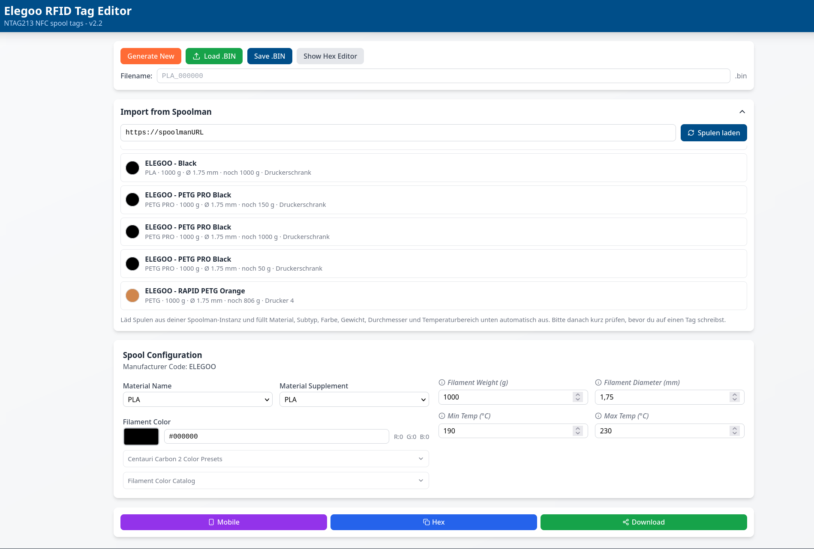

# Elegoo RFID Tag Editor – Anleitung / Guide

Repo: https://github.com/focmb/elegoo-rfid-editor

## Inhaltsverzeichnis / Table of Contents

**🇩🇪 Deutsch**
- [Wichtig: Die richtigen NFC-Tags kaufen](#wichtig-die-richtigen-nfc-tags-kaufen)
- [Variante 1: Lokal mit Node.js starten](#variante-1-lokal-mit-nodejs-starten)
- [Variante 2: Docker (empfohlen für Dauerbetrieb)](#variante-2-docker-empfohlen-für-dauerbetrieb)
- [Docker + Reverse Proxy mit HTTPS](#docker--reverse-proxy-mit-https-laut-instructionsmd)
- [Nutzung des Editors](#nutzung-des-editors-nach-dem-start)
- [Kurzübersicht](#kurzübersicht)

**🇬🇧 English**
- [Important: Buying the right NFC tags](#important-buying-the-right-nfc-tags)
- [Option 1: Run locally with Node.js](#option-1-run-locally-with-nodejs)
- [Option 2: Docker (recommended for permanent use)](#option-2-docker-recommended-for-permanent-use)
- [Docker + Reverse Proxy with HTTPS](#docker--reverse-proxy-with-https-per-instructionsmd)
- [Using the Editor](#using-the-editor-after-startup)
- [Quick Overview](#quick-overview)

---

# Screenshot



# 🇩🇪 Deutsch

Web-basierter Editor für Elegoo NTAG213 NFC-Spulen-Tags, mit zusätzlicher **Spoolman-Integration**. Läuft komplett im Browser, alle Daten bleiben lokal.

> **Hinweis:** Dieses Repository ist ein **Fork** von [Savion/elegoo-rfid-editor](https://github.com/Savion/elegoo-rfid-editor). Der Fork ergänzt die Spoolman-Integration sowie die Docker-Unterstützung, die in dieser Anleitung beschrieben wird.

Es gibt zwei Wege, das Tool zu betreiben:

1. **Lokale Entwicklungsumgebung** (Node.js / npm)
2. **Docker** (empfohlen für dauerhaften Betrieb, z. B. auf einem Homeserver/NAS)

---

## Wichtig: Die richtigen NFC-Tags kaufen

Der Editor ist speziell für **NTAG213**-Chips gemacht. Nicht jeder als „NTAG213" beworbene Tag hält aber, was er verspricht — viele Billig-Chargen haben weniger nutzbaren Speicher als spezifiziert oder sind gar keine echten NXP-Chips. Achte beim Kauf auf Folgendes:

- **Explizit „144 Byte User Memory" in der Produktbeschreibung suchen** — nicht 137, nicht 132, nicht „bis zu 144". Nur die volle Angabe von 144 Byte garantiert, dass genug beschreibbarer Speicher für den vollständigen Elegoo-Tag-Datensatz vorhanden ist.
- **Idealerweise Angebote wählen, die ausdrücklich mit Amiibo-/TagMo-Kompatibilität werben** — dort wird meist strenger auf echte NXP-Chips mit vollen 144 Byte geachtet, weil diese Community sehr genau auf Chip-Echtheit prüft und unzuverlässige Chargen schnell in den Rezensionen durchfallen.
- **Rezensionen gezielt nach Stichworten durchsuchen** wie „NDEF", „144 bytes", „vollständig beschreibbar" — das sind gute Indikatoren, dass andere Käufer den Speicher tatsächlich geprüft haben.

---

## Variante 1: Lokal mit Node.js starten

### Voraussetzungen
- Node.js 18+ und npm
- Ein moderner Browser (Chrome/Edge, Firefox, Safari)

### Schritte

```bash
# Repository klonen
git clone https://github.com/focmb/elegoo-rfid-editor.git
cd elegoo-rfid-editor

# Abhängigkeiten installieren
npm install

# Dev-Server starten
npm run dev
```

Der Editor ist danach unter `http://localhost:5173` erreichbar.

Willst du ihn auch aus dem lokalen Netzwerk (z. B. vom Handy) erreichen, starte stattdessen:

```bash
npm run dev -- --host 0.0.0.0
```

### Production-Build (optional)

```bash
npm run build
```

Die fertigen Dateien landen im Ordner `dist/` und können mit einem beliebigen Webserver (nginx, Apache, etc.) ausgeliefert werden.

---

## Variante 2: Docker (empfohlen für Dauerbetrieb)

Das Repo bringt ein `Dockerfile` und eine fertige `compose.yaml` mit, die den RFID-Editor **und optional Spoolman** in Containern startet.

### Schritt 1: Repo klonen

```bash
git clone https://github.com/focmb/elegoo-rfid-editor.git
cd elegoo-rfid-editor
```

### Schritt 2: `compose.yaml` anpassen

Die mitgelieferte `compose.yaml` sieht so aus:

```yaml
services:
  elegoo-rfid-editor:
    build:
      context: .
      dockerfile: Dockerfile
    container_name: centauri-rfid-editor
    restart: unless-stopped
    ports:
      - "172.16.1.4:8092:80"
    healthcheck:
      test: ["CMD", "wget", "-q", "--spider", "http://localhost/"]
      interval: 30s
      timeout: 5s
      retries: 3
      start_period: 10s

  spoolman:
    image: ghcr.io/donkie/spoolman:latest
    container_name: centauri-spoolman
    restart: unless-stopped
    volumes:
      - type: bind
        source: ./spoolman-data
        target: /home/app/.local/share/spoolman
    ports:
      - "172.16.1.4:7912:8000"
    environment:
      - TZ=Europe/Berlin
    healthcheck:
      test: ["CMD", "python3", "-c", "import urllib.request; urllib.request.urlopen('http://localhost:8000/')"]
      interval: 30s
      timeout: 5s
      retries: 3
      start_period: 10s
```

**Wichtig:** Die IP `172.16.1.4` ist die IP des Autors und muss auf deine eigene Server-/Host-IP angepasst werden — oder du entfernst die IP-Bindung ganz, damit die Ports auf allen Interfaces (`0.0.0.0`) gebunden werden:

```yaml
    ports:
      - "8092:80"       # statt 172.16.1.4:8092:80
```
```yaml
    ports:
      - "7912:8000"     # statt 172.16.1.4:7912:8000
```

Falls du Spoolman bereits separat betreibst, kannst du den `spoolman`-Service aus der `compose.yaml` einfach entfernen und nur den Editor bauen.

### Schritt 3: Container starten

```bash
docker compose up -d --build
```

Danach ist:
- der **RFID-Editor** unter `http://<server-ip>:8092` erreichbar
- **Spoolman** (falls aktiviert) unter `http://<server-ip>:7912` erreichbar

### Schritt 4: Spoolman-URL im Editor eintragen

Im Editor unter den Einstellungen die Spoolman-URL (IP:Port, z. B. `192.168.1.10:7912`) hinterlegen, damit die Integration funktioniert.

---

## Docker + Reverse Proxy mit HTTPS (laut `Instructions.md`)

Für den produktiven Einsatz empfiehlt der Autor, Editor und Spoolman **über HTTPS mit eigenem Domain-Zertifikat** per Nginx-Reverse-Proxy bereitzustellen. Es gibt dafür zwei Wege:

### Option A: Nginx Reverse Proxy (empfohlen)

Beispiel-VHost-Konfiguration:

```nginx
server {
    listen 443 ssl;
    http2 on;
    server_name rfideditor.domain.de;
    ssl_certificate ...;
    ssl_certificate_key ...;

    location / {
        proxy_pass http://172.16.1.4:8092;  # IP:Port des elegoo-rfid-editor Containers
        proxy_set_header Host $host;
    }

    location /spoolman/ {
        proxy_pass http://172.16.1.4:7912/;  # IP:Port des Spoolman-Containers
        proxy_set_header Host $host;
        proxy_set_header X-Real-IP $remote_addr;
    }
}
```

Passe `server_name`, die Zertifikatspfade sowie die IP-Adressen/Ports an deine Umgebung an. Diese Konfigurationsdatei liegt im Repo bereits als Vorlage unter `NginxVHost`.

### Option B: CORS in Spoolman aktivieren

Alternativ zum Reverse Proxy kann man in Spoolman direkt CORS erlauben, indem man in der `compose.yaml` die Umgebungsvariable `SPOOLMAN_CORS_ORIGIN` setzt:

```yaml
spoolman:
  image: ghcr.io/donkie/spoolman:latest
  container_name: centauri-spoolman
  restart: unless-stopped
  volumes:
    - type: bind
      source: ./spoolman-data
      target: /home/app/.local/share/spoolman
  ports:
    - "172.16.1.4:7912:8000"
  environment:
    - TZ=Europe/Berlin
    - SPOOLMAN_CORS_ORIGIN=http://172.31.0.3:5173   # IP:Port des elegoo-rfid-editors
```

**Voraussetzung** laut Repo: Spoolman läuft selfhosted (Docker) und beide Dienste (Editor & Spoolman) sind über HTTPS mit echten Zertifikaten erreichbar.

---

## Nutzung des Editors (nach dem Start)

1. Editor im Browser öffnen (lokale URL oder eigene Domain)
2. **„Generate New"** klicken für ein neues Tag, oder **„Load .BIN"** um ein vorhandenes zu bearbeiten
3. **Material** und **Subtype** auswählen (z. B. PLA, PLA-CF, PETG-GF, …)
4. **Filament-Farbe** wählen — entweder per RGB/Hex-Picker oder über den Hersteller-Farbkatalog (2900+ Farben, 19 Marken); bei Katalogauswahl werden Material, Subtype und Farbe automatisch übernommen
5. Optional: Gewicht, Durchmesser, Temperaturbereich eintragen
6. **Export** für mobile Nutzung oder **Save .BIN** zum lokalen Speichern

### Auf dem Smartphone (Android/iOS)

1. Web-App in Chrome (Android) öffnen und **„Zum Startbildschirm hinzufügen"** wählen
2. Tag laden oder erstellen
3. **Option A — Web NFC (nur Chrome Android):** direktes Lesen/Schreiben des Tags über die eingebaute NFC-Funktion
4. **Option B — Export:** Auf **„Mobile"** tippen, Befehle kopieren und in die entsprechende NFC-App einfügen:
   - **Android:** RFID Tools → Other → Advanced RFID Commands
   - **iOS:** NFC Tools → Other → Advanced RFID Commands

---

## Kurzübersicht

| Variante | Befehl | Erreichbar unter |
|---|---|---|
| Lokal (Dev) | `npm run dev` | `http://localhost:5173` |
| Lokal (Netzwerk) | `npm run dev -- --host 0.0.0.0` | `http://<deine-ip>:5173` |
| Docker | `docker compose up -d --build` | `http://<server-ip>:8092` (Editor), `:7912` (Spoolman) |
| Docker + Reverse Proxy | wie oben + Nginx-VHost | `https://rfideditor.deine-domain.de` |

**Hinweis:** Das Tool ist für den privaten/edukativen Gebrauch gedacht — stelle sicher, dass du berechtigt bist, die jeweiligen RFID-Tags zu verändern.

---
---

# 🇬🇧 English

Browser-based editor for Elegoo NTAG213 NFC spool tags, with an added **Spoolman integration**. Runs entirely in the browser; all data stays local.

> **Note:** This repository is a **fork** of [Savion/elegoo-rfid-editor](https://github.com/Savion/elegoo-rfid-editor). The fork adds the Spoolman integration and the Docker support described in this guide.

There are two ways to run the tool:

1. **Local development setup** (Node.js / npm)
2. **Docker** (recommended for permanent use, e.g. on a home server/NAS)

---

## Important: Buying the right NFC tags

The editor is specifically built for **NTAG213** chips. However, not every tag advertised as "NTAG213" actually delivers what it claims — many cheap batches have less usable memory than specified, or aren't genuine NXP chips at all. When buying, pay attention to the following:

- **Explicitly look for "144 byte User Memory" in the product description** — not 137, not 132, not "up to 144". Only the full 144-byte spec guarantees enough writable memory for the complete Elegoo tag data set.
- **Ideally choose listings that explicitly advertise Amiibo/TagMo compatibility** — that community tends to scrutinize genuine NXP chips with the full 144 bytes much more closely, since they check chip authenticity very carefully and unreliable batches quickly get called out in reviews.
- **Search reviews specifically for keywords** like "NDEF", "144 bytes", "fully writable" — these are good indicators that other buyers actually verified the memory.

---

## Option 1: Run locally with Node.js

### Requirements
- Node.js 18+ and npm
- A modern browser (Chrome/Edge, Firefox, Safari)

### Steps

```bash
# Clone the repository
git clone https://github.com/focmb/elegoo-rfid-editor.git
cd elegoo-rfid-editor

# Install dependencies
npm install

# Start the dev server
npm run dev
```

The editor will then be available at `http://localhost:5173`.

If you also want to reach it from your local network (e.g. from your phone), start it like this instead:

```bash
npm run dev -- --host 0.0.0.0
```

### Production build (optional)

```bash
npm run build
```

The built files will be placed in the `dist/` folder and can be served with any web server (nginx, Apache, etc.).

---

## Option 2: Docker (recommended for permanent use)

The repo ships with a `Dockerfile` and a ready-made `compose.yaml` that starts the RFID editor **and, optionally, Spoolman** as containers.

### Step 1: Clone the repo

```bash
git clone https://github.com/focmb/elegoo-rfid-editor.git
cd elegoo-rfid-editor
```

### Step 2: Adjust `compose.yaml`

The provided `compose.yaml` looks like this:

```yaml
services:
  elegoo-rfid-editor:
    build:
      context: .
      dockerfile: Dockerfile
    container_name: centauri-rfid-editor
    restart: unless-stopped
    ports:
      - "172.16.1.4:8092:80"
    healthcheck:
      test: ["CMD", "wget", "-q", "--spider", "http://localhost/"]
      interval: 30s
      timeout: 5s
      retries: 3
      start_period: 10s

  spoolman:
    image: ghcr.io/donkie/spoolman:latest
    container_name: centauri-spoolman
    restart: unless-stopped
    volumes:
      - type: bind
        source: ./spoolman-data
        target: /home/app/.local/share/spoolman
    ports:
      - "172.16.1.4:7912:8000"
    environment:
      - TZ=Europe/Berlin
    healthcheck:
      test: ["CMD", "python3", "-c", "import urllib.request; urllib.request.urlopen('http://localhost:8000/')"]
      interval: 30s
      timeout: 5s
      retries: 3
      start_period: 10s
```

**Important:** The IP `172.16.1.4` belongs to the author's own server and must be changed to your own host/server IP — or you can remove the IP binding entirely so the ports bind on all interfaces (`0.0.0.0`):

```yaml
    ports:
      - "8092:80"       # instead of 172.16.1.4:8092:80
```
```yaml
    ports:
      - "7912:8000"     # instead of 172.16.1.4:7912:8000
```

If you already run Spoolman separately, you can simply remove the `spoolman` service from `compose.yaml` and only build the editor.

### Step 3: Start the containers

```bash
docker compose up -d --build
```

After that:
- the **RFID editor** is reachable at `http://<server-ip>:8092`
- **Spoolman** (if enabled) is reachable at `http://<server-ip>:7912`

### Step 4: Enter the Spoolman URL in the editor

In the editor's settings, enter the Spoolman URL (IP:port, e.g. `192.168.1.10:7912`) so the integration works.

---

## Docker + Reverse Proxy with HTTPS (per `Instructions.md`)

For production use, the author recommends serving both the editor and Spoolman **over HTTPS with a proper domain certificate** via an Nginx reverse proxy. There are two ways to do this:

### Option A: Nginx reverse proxy (recommended)

Example VHost configuration:

```nginx
server {
    listen 443 ssl;
    http2 on;
    server_name rfideditor.domain.de;
    ssl_certificate ...;
    ssl_certificate_key ...;

    location / {
        proxy_pass http://172.16.1.4:8092;  # IP:port of the elegoo-rfid-editor container
        proxy_set_header Host $host;
    }

    location /spoolman/ {
        proxy_pass http://172.16.1.4:7912/;  # IP:port of the Spoolman container
        proxy_set_header Host $host;
        proxy_set_header X-Real-IP $remote_addr;
    }
}
```

Adjust `server_name`, the certificate paths, and the IP addresses/ports to match your own environment. This config file is already included in the repo as a template under `NginxVHost`.

### Option B: Enable CORS in Spoolman

As an alternative to the reverse proxy, you can enable CORS directly in Spoolman by setting the `SPOOLMAN_CORS_ORIGIN` environment variable in `compose.yaml`:

```yaml
spoolman:
  image: ghcr.io/donkie/spoolman:latest
  container_name: centauri-spoolman
  restart: unless-stopped
  volumes:
    - type: bind
      source: ./spoolman-data
      target: /home/app/.local/share/spoolman
  ports:
    - "172.16.1.4:7912:8000"
  environment:
    - TZ=Europe/Berlin
    - SPOOLMAN_CORS_ORIGIN=http://172.31.0.3:5173   # IP:port of the elegoo-rfid-editor
```

**Requirement** per the repo: Spoolman is self-hosted (Docker), and both services (editor & Spoolman) are reachable over HTTPS with valid certificates.

---

## Using the Editor (after startup)

1. Open the editor in your browser (local URL or your own domain)
2. Click **"Generate New"** for a blank tag, or **"Load .BIN"** to edit an existing one
3. Select your **Material** and **Subtype** (e.g. PLA, PLA-CF, PETG-GF, …)
4. Pick your **filament color** — either via the RGB/hex picker or by browsing the manufacturer color catalog (2900+ colors, 19 brands); selecting a catalog color automatically sets material, subtype, and color
5. Optionally set weight, diameter, and temperature range
6. **Export** for mobile use, or **Save .BIN** to store it locally

### On mobile (Android/iOS)

1. Open the web app in Chrome on Android and choose **"Add to Home Screen"**
2. Load or create a tag
3. **Option A — Web NFC (Chrome on Android only):** read/write the tag directly using the built-in NFC feature
4. **Option B — Export:** Tap **"Mobile"**, copy the commands, and paste them into the appropriate NFC app:
   - **Android:** RFID Tools → Other → Advanced RFID Commands
   - **iOS:** NFC Tools → Other → Advanced RFID Commands

---

## Quick Overview

| Mode | Command | Reachable at |
|---|---|---|
| Local (dev) | `npm run dev` | `http://localhost:5173` |
| Local (network) | `npm run dev -- --host 0.0.0.0` | `http://<your-ip>:5173` |
| Docker | `docker compose up -d --build` | `http://<server-ip>:8092` (editor), `:7912` (Spoolman) |
| Docker + reverse proxy | as above + Nginx VHost | `https://rfideditor.yourdomain.com` |

**Note:** This tool is intended for personal/educational use — make sure you're authorized to modify the RFID tags in question.
